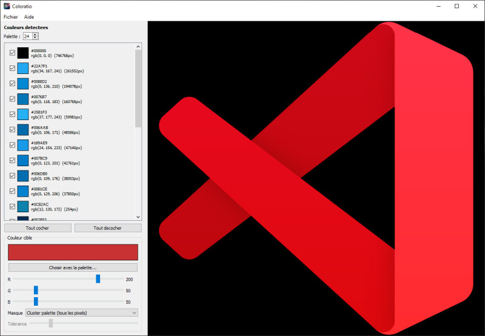

<p align="center">
  <a href="https://github.com/Game-K-Hack/coloratio/releases/latest"></a>
</p>

[:fr: Français](./README.fr.md) | 
[:uk: English](../README.md) | 
[:kr: 한국어](./README.ko.md) | 
[:jp: 日本語](./README.ja.md) | 
[:cn: 中文](./README.zh.md) | 
[:it: Italiano](./README.it.md) | 
[:es: Español](./README.es.md) | 
**:ru: Русский** | 
[:de: Deutsch](./README.de.md)

### Coloratio

**Coloratio** — это интерактивное настольное приложение для изменения цветов изображения с сохранением визуальной согласованности оттенков. Приложение автоматически определяет доминирующие цвета вашего изображения (квантованная палитра), позволяет выбрать один или несколько с помощью флажков, а затем применяет относительный сдвиг HSV к целевому цвету. Соотношение между выбранными цветами сохраняется: при смещении группы синих оттенков к зелёному относительные тона остаются неизменными.

Построенное на **PyQt5**, **Pillow** и **NumPy**, Coloratio поддерживает изображения высокого разрешения (автоматическое уменьшение для предпросмотра, применение в полном разрешении при сохранении) и использует многопоточность, чтобы интерфейс оставался отзывчивым во время обработки.



---

### Установка

```
git clone https://github.com/Game-K-Hack/coloratio.git
cd coloratio
pip install -r requirements.txt
```

#### Запуск графического интерфейса

```
python main.py
```

#### Сборка EXE

```
pyinstaller --noconfirm build.spec
```
